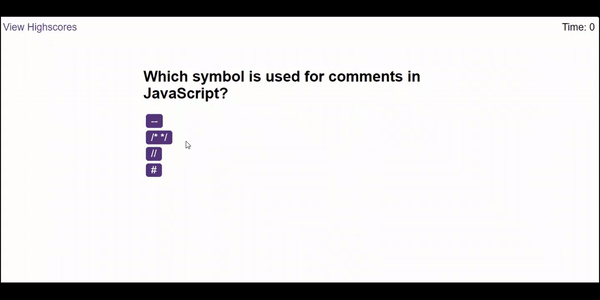

# JavaScript-Quiz

## Overview
Welcome to the JavaScript Quiz App – a learning tool designed to improve your JavaScript knowledge. This project provides a user-friendly quiz experience, with features for tracking scores and challenging yourself against peers.

### Key Features
Timed Quiz: Engage in a timed quiz to test your JavaScript proficiency.
Score Storage: Save your scores along with initials for future reference.
High Scores Page: Review high scores and compare your performance.
Clear High Scores: Start afresh by clearing the high scores list.

# Getting Started
Clone the Repository:
1. bash
2. Copy code
3. git clone git@github.com:KevinDsouza7/JavaScript-Quiz.git
4. Open the index.html file in your preferred web browser.

## Usage

# Link to application :https://kevindsouza7.github.io/JavaScript-Quiz/

Click the "Start Quiz" button to initiate the quiz.
Answer Questions:

Respond to each question by selecting the correct multiple-choice option.

## Score Calculation:

Incorrect answers lead to a time deduction from the timer.
Completion:

When the quiz concludes or the timer reaches 0, your final score is displayed.
Save High Score:

Enter your initials and click "Submit" to store your high score.
View High Scores:

Access the high scores page by clicking "View Highscores."

# Screenshots

### Contributing
If you wish to contribute to this project:

1. Fork the repository and create a new branch for your feature.

2. Commit your changes with a clear and concise message.

3. Push your changes to the branch you created in your fork.

4. Submit a pull request for your changes to be reviewed and merged.

# License
This project is licensed under the MIT License.

**Thank you for choosing the JavaScript Quiz App. Happy coding!** 🚀

